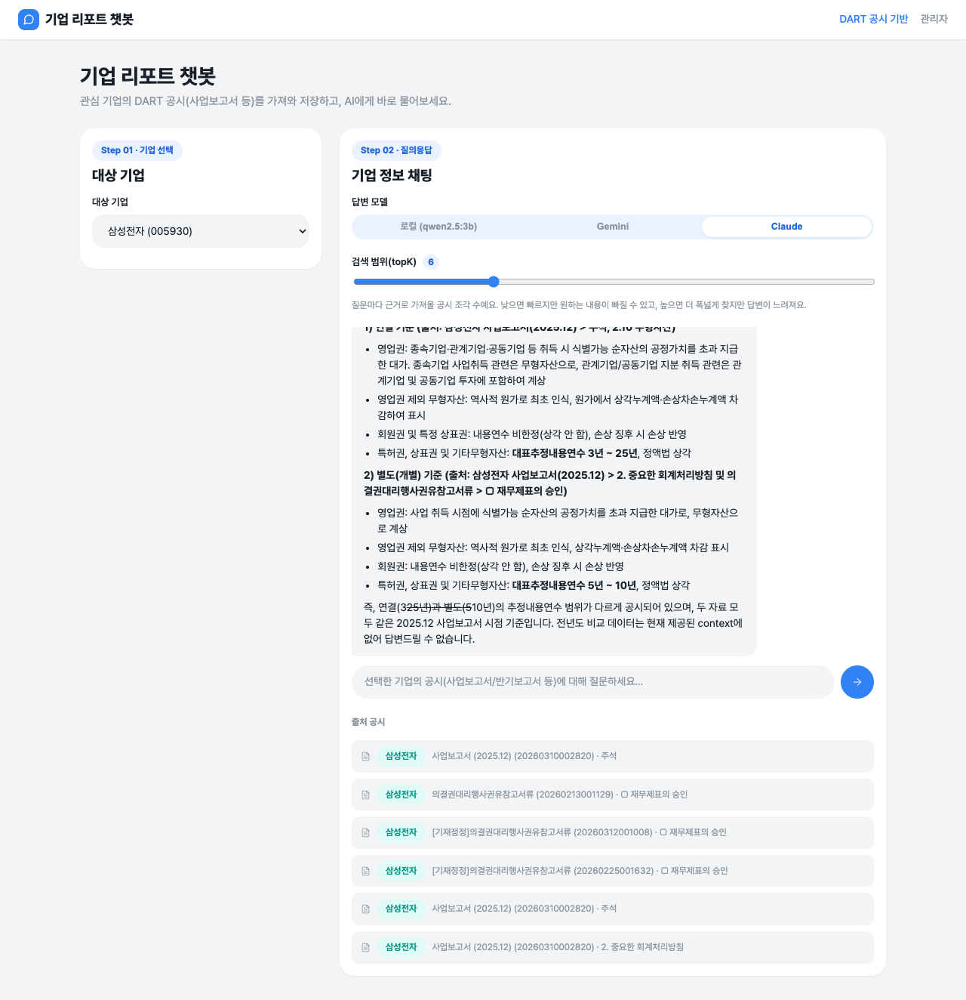
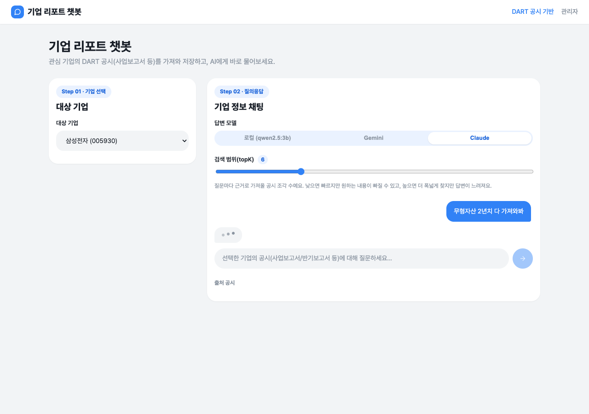
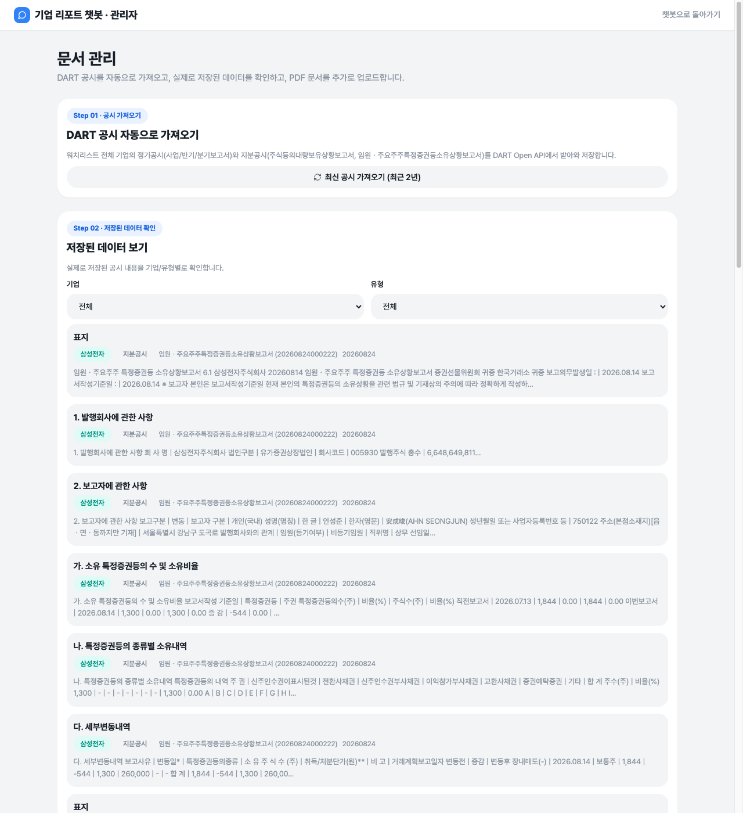
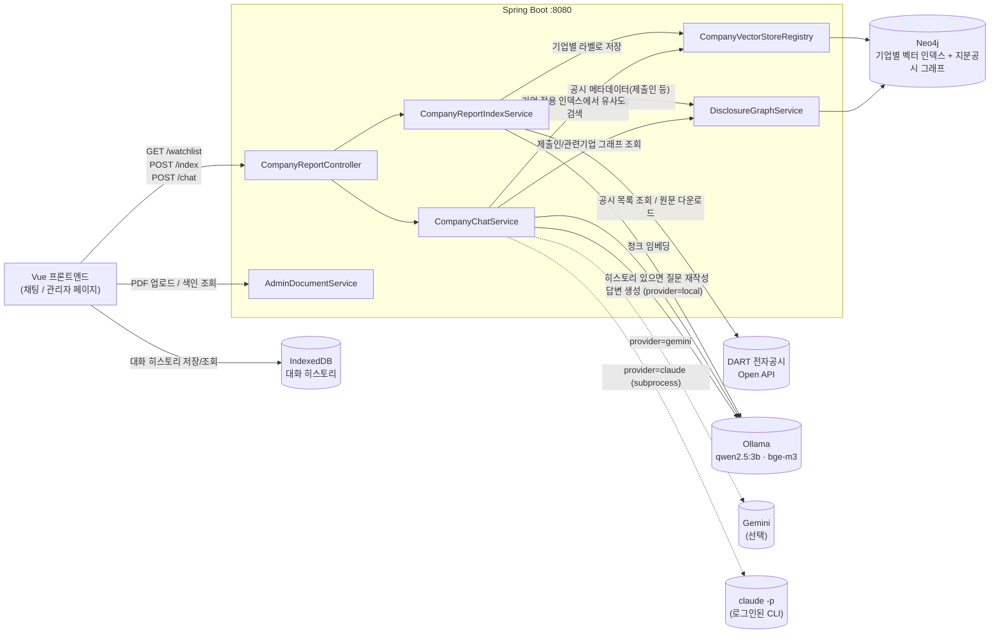

# 기업 리포트 챗봇 (Spring Boot + Spring AI + Neo4j)

DART 전자공시(사업보고서/반기보고서/분기보고서 + 지분공시) 원문을 근거로 관심 기업에
대해 질의응답하는 RAG 챗봇입니다. 워치리스트에 등록된 기업의 공시를 DART Open API에서
받아와 기업별로 분리된 벡터스토어(Neo4j)에 색인하고, 채팅 시 해당 기업의 공시 내용만
근거로 답변합니다. 대화 히스토리를 참고해 후속 질문을 재작성하고, 로컬(Ollama)/
Gemini/Claude(로그인된 Claude Code CLI) 중 답변 모델을 선택해 품질을 비교할 수
있습니다. 답변은 표/목록/굵게 등이 그대로 보이도록 마크다운으로 렌더링되고, 응답을
기다리는 동안에는 타이핑 인디케이터가 표시됩니다.

## 사용 화면



기업을 선택하고 최신 공시를 색인한 뒤, 선택한 기업의 공시 내용에 대해 자유롭게
질문하면 답변과 함께 근거가 된 공시(회사명/보고서명/접수번호/섹션)를 보여줍니다.
채팅창 상단에서 답변 모델(로컬 qwen2.5:3b / Gemini / Claude)과 검색 범위(topK)를
직접 조절할 수 있고, 이전 대화는 브라우저에 저장되어 후속 질문에 참고됩니다. 답변에
표나 목록이 포함되어 있으면 마크다운으로 그대로 렌더링됩니다.



질문을 보내면 답변이 도착하기 전까지 채팅창에 타이핑 인디케이터(점 3개)가 표시되어
현재 답변을 생성 중임을 알려줍니다.



관리자 페이지(`/admin.html`)에서는 워치리스트 전체 기업의 정기공시+지분공시를 한
번에 가져오고, 실제로 Neo4j에 저장된 청크를 기업/유형별로 필터링해서 직접 확인할
수 있습니다. PDF 직접 업로드와 지분공시 제출인/관련기업 그래프 탐색도 같은 페이지
안에서 할 수 있습니다.

## 아키텍처



색인 흐름: DART에서 공시 원문(XML)을 받아 목차 단위로 분해 → 기업/공시 메타데이터를
태깅 → 토큰 단위로 청킹 → 기업별로 분리된 Neo4j 라벨/인덱스(`CompanyReportChunk_{corpCode}`)에
저장. 지분공시(대량보유상황보고서, 임원·주요주주소유보고서)는 별도로 제출인(Filer)-공시(Report)-
기업(Company) 그래프에도 기록됩니다. 같은 공시 파일은 해시로 비교해 변경이 없으면
재색인하지 않습니다(DART API 일일 호출 제한 대응).

채팅 흐름: 브라우저에 저장된 최근 대화가 있으면 먼저 LLM으로 후속 질문을 독립형 질문으로
재작성 → 해당 기업 전용 벡터 인덱스에서 유사도 검색(다른 기업 데이터가 섞이지 않음) →
지분공시 그래프에서 제출인 정보 보강 → context 기반 답변 생성. 로컬(Ollama qwen2.5:3b),
Gemini, Claude(로그인된 `claude -p` CLI를 서브프로세스로 호출 — API 키 불필요, claude.ai
구독 계정 로그인 그대로 사용) 중 선택해서 같은 질문의 답변 품질을 비교할 수 있습니다.

## 기술 스택

- **Backend**: Spring Boot 3.4, Spring AI 1.0 (Ollama 모델 + Neo4j 벡터스토어)
- **LLM/임베딩**: Ollama (`qwen2.5:3b` 채팅, `bge-m3` 임베딩) 기본, 선택적으로
  Google Gemini(REST API 직접 호출 — Spring AI Google GenAI 스타터는 1.1.0+ 필요해서
  현재 1.0.0 BOM과 맞지 않아 `RestClient`로 직접 연동) 또는 Claude(로그인된
  `claude -p` CLI를 서브프로세스로 호출 — API 키 없이 claude.ai 구독 계정 그대로 사용)
- **벡터스토어**: Neo4j (기업마다 별도 라벨/인덱스로 분리), 지분공시 그래프도 같은 Neo4j에 저장
- **외부 API**: DART(전자공시시스템) Open API, Google Gemini API(선택)
- **Frontend**: Vue 3 + TypeScript + Vite, 대화 히스토리는 브라우저 IndexedDB에 저장.
  답변은 `marked`로 마크다운 파싱 후 `DOMPurify`로 sanitize해 렌더링

## 실행 방법

### 1) 사전 준비

**Ollama** (로컬에서 실행 중이어야 함):

```bash
ollama serve
ollama pull qwen2.5:3b
ollama pull bge-m3
```

**Neo4j** (Docker 예시):

```bash
docker volume create company-report-neo4j-data
docker volume create company-report-neo4j-logs

docker run -d --name company-report-neo4j \
  -p 7474:7474 -p 7687:7687 \
  -e NEO4J_AUTH=neo4j/companyreport \
  -v company-report-neo4j-data:/data \
  -v company-report-neo4j-logs:/logs \
  neo4j:5.15
```

`-v`로 이름 있는 볼륨을 지정해야 `docker rm`으로 컨테이너를 지웠다가 같은 명령으로
다시 만들어도 색인된 데이터가 그대로 유지됩니다(볼륨을 안 붙이면 컨테이너 삭제 시
데이터도 함께 사라집니다).

기본 접속 정보는 `application.yml`에 설정되어 있으며, 필요 시 환경변수로 덮어쓸 수
있습니다: `NEO4J_URI`, `NEO4J_USERNAME`, `NEO4J_PASSWORD`.

**DART API 키**: [DART Open API](https://opendart.fss.or.kr)에서 발급받아
`DART_API_KEY` 환경변수로 설정합니다.

```bash
export DART_API_KEY=발급받은키
```

**Gemini API 키 (선택)**: 채팅에서 "Gemini" 모델을 쓰려면
[Google AI Studio](https://aistudio.google.com/apikey)에서 발급받은 키(`AIzaSy...`
형태)를 `GEMINI_API_KEY` 환경변수로 설정합니다. 설정 안 하면 Gemini 옵션 선택 시
에러가 나고, 로컬(Ollama)만으로도 정상 동작합니다. **키를 코드나 `.env` 파일에 직접
적지 말고 반드시 환경변수로만 주입하세요** — `.env`는 `.gitignore`에 포함되어 있습니다.

```bash
export GEMINI_API_KEY=발급받은키
```

**Claude CLI (선택)**: 채팅에서 "Claude" 모델을 쓰려면 이 머신에 [Claude
Code CLI](https://claude.com/claude-code)가 설치되어 있고 `claude` 명령이
PATH에 잡혀 있어야 하며, `claude login`으로 claude.ai 계정에 로그인되어 있어야
합니다. 백엔드가 API 키 없이 `claude -p` 서브프로세스를 그대로 호출하는 방식이라
별도 키 설정은 필요 없습니다. CLI가 없거나 로그인이 안 되어 있으면 Claude 옵션
선택 시 에러가 납니다.

### 2) 실행

```bash
./gradlew bootRun
```

프론트엔드 빌드(`npm install` + `npm run build`)까지 자동으로 수행한 뒤
`http://localhost:8080`에서 앱 전체(백엔드+프론트)가 뜹니다. 관리자 페이지는
`http://localhost:8080/admin.html`.

프론트엔드만 빠르게 붙여서 UI를 확인하려면(핫리로드):

```bash
cd frontend
npm install
npm run dev   # http://localhost:5173, /api는 8080으로 프록시
```

### 3) 사용 순서

1. 기업 선택 후 "최신 공시 가져오기"로 최근 2년치 공시(정기공시 + 지분공시) 색인
2. 채팅창 상단에서 답변 모델(로컬/Gemini/Claude)과 검색 범위(topK) 선택
3. 궁금한 내용 질문 (예: "사업의 개요 알려줘") — 이전 대화가 있으면 자동으로 참고됨
4. 답변 하단의 "출처 공시"에서 근거가 된 보고서 확인
5. 관리자 페이지(`/admin.html`)에서 PDF 직접 업로드, 색인된 청크 조회, 지분공시
   제출인/관련기업 그래프 탐색 가능

## API 엔드포인트

| Method | Path | 설명 |
|---|---|---|
| GET | `/api/company-report/watchlist` | 워치리스트 기업 목록 조회 |
| POST | `/api/company-report/index?bgn_de=&end_de=` | 워치리스트 기업의 공시 색인 (기간 미지정 시 최근 2년) |
| POST | `/api/company-report/chat` | `{ question, corpCode, history?, topK?, provider? }` → 답변 + 근거 공시 목록 |
| GET | `/api/admin/documents` | 어드민 업로드 문서 목록 |
| POST | `/api/admin/documents` | PDF 업로드 → 텍스트 추출 후 색인 |
| DELETE | `/api/admin/documents/{id}` | 업로드 문서 삭제 |
| GET | `/api/admin/indexed-chunks` | 색인된 청크 조회(디버깅/확인용) |
| GET | `/api/admin/graph/filers?corpCode=` | 특정 기업에 지분을 공시한 제출인 목록 |
| GET | `/api/admin/graph/related-companies?filerName=` | 특정 제출인이 지분을 공시한 다른 기업 목록 |

`POST /chat`의 `history`는 프론트엔드(IndexedDB)가 보관하는 최근 대화 몇 턴
(`[{role, content}]`)이며, 있으면 백엔드가 후속 질문을 독립형 질문으로 재작성한
뒤 검색합니다. `provider`는 `"local"`(기본값, Ollama), `"gemini"`, `"claude"`
(로그인된 `claude -p` CLI) 중 하나.

## 패키지 구조

```
src/main/java/com/ismsp/chatbot/
├── ChatbotApplication.java              # 엔트리포인트
├── controller/
│   ├── CompanyReportController.java     # REST API (watchlist / index / chat)
│   ├── AdminDocumentController.java     # 어드민 PDF 업로드/조회/삭제
│   ├── IndexedChunkController.java      # 색인된 청크 조회(디버깅용)
│   └── DisclosureGraphController.java   # 지분공시 그래프 조회(제출인/관련기업)
├── service/
│   ├── CompanyReportIndexService.java   # DART 공시 수집 → 청킹 → 기업별 인덱스 색인
│   ├── CompanyVectorStoreRegistry.java  # 기업(corp_code)마다 별도 Neo4j 벡터 인덱스/라벨 관리
│   ├── CompanyChatService.java          # 히스토리 기반 질문 재작성 + 유사도 검색 + RAG 답변 생성
│   ├── DisclosureGraphService.java      # 지분공시 제출인-공시-기업 그래프 기록/조회
│   ├── AdminDocumentService.java        # PDF 업로드 → 텍스트 추출 → 색인
│   └── IndexedChunkService.java         # 색인된 청크를 있는 그대로 조회(읽기 전용)
├── gemini/
│   └── GeminiApiClient.java             # Google Gemini generateContent REST 직접 호출
├── claude/
│   └── ClaudeCliClient.java             # 로그인된 `claude -p` CLI를 서브프로세스로 호출
├── dart/
│   ├── DartApiClient.java               # DART Open API 클라이언트 (공시검색/원본파일 다운로드)
│   ├── DartXmlDocumentReader.java       # 공시 XML → 목차 단위 Document 변환
│   ├── DartApiException.java
│   └── dto/                             # CorpCode, DartListResponse, DisclosureItem, WatchedCompany
└── dto/                                 # ChatRequest, ChatResponse, ChatTurnDto, SourceItem 등

src/main/resources/
├── application.yml                      # Ollama / Neo4j / DART / Gemini 설정 (Claude CLI는 설정 불필요)
└── static/                              # 빌드된 프론트엔드 산출물 (npm run build 결과, 자동 생성)

frontend/
├── index.html / admin.html
└── src/
    ├── main.ts / admin-main.ts
    ├── App.vue                          # 채팅 페이지 레이아웃
    ├── AdminApp.vue                     # 관리자 페이지 레이아웃
    ├── style.css                        # 디자인 토큰 + 컴포넌트 스타일
    ├── api.ts                           # 백엔드 REST 호출
    ├── chatHistory.ts                   # 대화 히스토리 IndexedDB 저장/조회
    └── components/
        ├── CompanySelector.vue          # 기업 선택 + 공시 갱신
        ├── ChatPanel.vue                # 채팅 UI (로컬/Gemini/Claude 토글, topK, 출처, 히스토리)
        ├── DartIndexPanel.vue           # 관리자: DART 공시 재색인 트리거
        ├── AdminDocumentUpload.vue      # 관리자: PDF 업로드
        ├── AdminDocumentList.vue        # 관리자: 업로드 문서 목록/삭제
        ├── IndexedDataViewer.vue        # 관리자: 색인된 청크 브라우징
        └── RelationshipExplorer.vue     # 관리자: 지분공시 제출인/관련기업 그래프 탐색
```

## 참고

- 워치리스트는 `WatchedCompany.ALL`에 하드코딩되어 있습니다 (현재: 삼성전자, F&F).
  다른 기업을 추가하려면 DART 고유번호(`corp_code`)를 찾아 목록에 추가하면 됩니다.
- DART `document.xml` 원본만 다루며, `pdf.do`(브라우저 세션 기반 비공개 엔드포인트)는
  API로 안정적으로 받을 수 없어 지원하지 않습니다.
- 대화 히스토리는 브라우저 IndexedDB에 기업(corp_code)별로 저장됩니다. 브라우저
  데이터를 지우거나 다른 브라우저/기기로 접속하면 히스토리는 보이지 않습니다(서버에는
  저장하지 않음).
- qwen2.5:3b는 3B급 소형 모델이라 후속 질문 재작성/답변 품질이 완벽하지 않을 수
  있습니다 — 이럴 때 Gemini/Claude 옵션으로 같은 질문을 비교해보는 용도입니다.
- Claude 옵션은 매 질문마다 `claude -p` 프로세스를 새로 띄우기 때문에 로컬/Gemini
  보다 느립니다(수 초~수십 초). 또 별도 API 과금이 아니라 이 CLI가 로그인된
  claude.ai 계정의 사용량(플랜 한도)을 그대로 씁니다.
