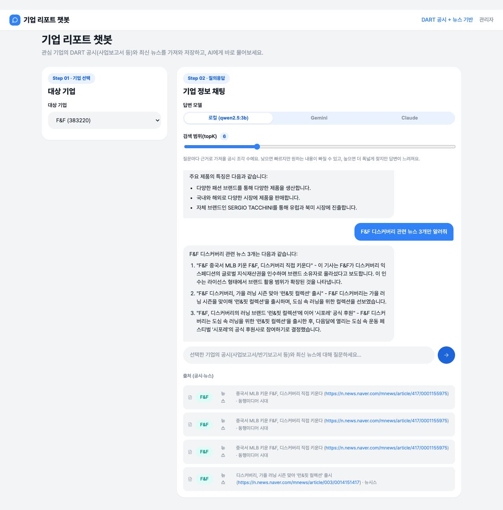
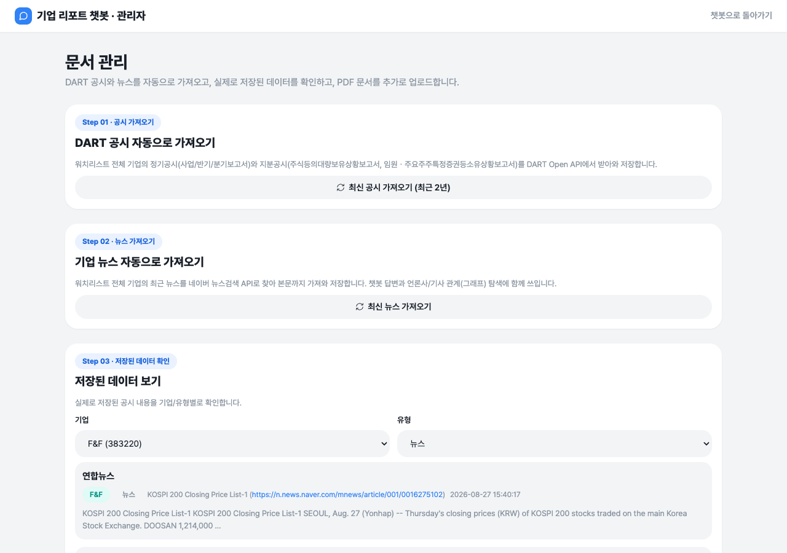
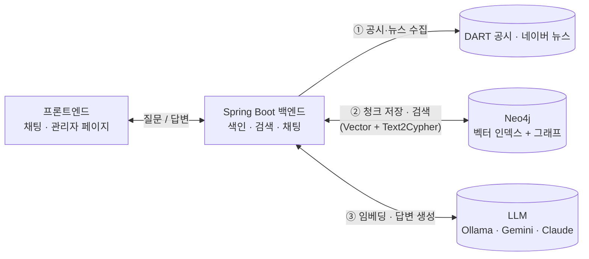
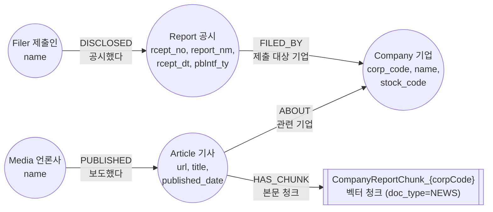

# 기업 리포트 챗봇(RAG)

DART 전자공시(사업/반기/분기보고서 + 지분공시)와 관련 뉴스를 근거로 관심 기업에
답변하는 RAG 챗봇입니다. 공시는 DART API, 뉴스는 네이버 검색결과 페이지(API 키
불필요)에서 가져와 기업별 Neo4j 벡터 인덱스에 함께 저장합니다. 지분공시 제출인과
뉴스 기사 관계는 그래프로도 저장해서, 벡터 검색(Vector Retriever)만으로 안 되는
집계·랭킹 질문은 LLM이 즉석에서 만든 Cypher(Text2Cypher)로 답합니다. 로컬(Ollama)/
Gemini/Claude 중 답변 모델을 골라 비교할 수 있고, 답변은 마크다운으로 렌더링됩니다.

## 사용 화면


기업을 고르고 질문하면 답변과 함께 근거 공시(회사명/보고서명/접수번호/섹션)를
보여줍니다. 답변 모델(로컬/Gemini/Claude)과 검색 범위(topK)를 조절할 수 있고,
표/목록이 포함된 답변은 마크다운으로 렌더링됩니다.


답변 생성 중에는 타이핑 인디케이터(점 3개)가 표시됩니다.


관리자 페이지(`/admin.html`)에서 공시를 한 번에 가져오고, Neo4j에 저장된 청크를
기업/유형별로 확인할 수 있습니다. PDF 업로드와 지분공시 그래프 탐색도 여기서.



뉴스 질문("F&F 디스커버리 관련 뉴스 3개만 알려줘")을 하면 실제 뉴스 기사가
근거로 잡히고, 출처에 "뉴스" 태그와 원문 링크가 함께 표시됩니다.



유형을 "뉴스"로 필터링하면 색인된 기사 목록을 확인하고, URL을 클릭해 원문으로
바로 이동할 수 있습니다.

## 아키텍처



- **① 공시·뉴스 수집**: DART 공시(XML)는 목차 단위로 분해, 뉴스는 네이버 검색결과·
  기사 페이지를 파싱(API 키 불필요)해서 본문을 가져옵니다. 둘 다 청킹 후 같은 기업
  전용 Neo4j 인덱스에 저장되고(뉴스는 `doc_type=NEWS`로 구분), 지분공시 제출인/뉴스
  기사-언론사 관계는 그래프로도 함께 기록됩니다. 변경 없는 공시·이미 수집한 기사
  URL은 재수집하지 않습니다.
- **② 검색**: 질문을 임베딩해 기업 전용 인덱스에서 유사도 검색(Vector Retriever,
  뉴스 키워드면 `doc_type=NEWS`로 필터). 집계·랭킹처럼 벡터 검색만으로 안 되는
  그래프 질문이면 LLM이 즉석에서 Cypher를 생성해 실행(Text2Cypher), 실패하면 고정
  조회로 폴백합니다.
- **③ 답변**: 대화 히스토리가 있으면 먼저 후속 질문을 독립형으로 재작성한 뒤, 위
  검색 결과를 근거로 로컬(Ollama)/Gemini/Claude 중 선택한 모델이 답변을 생성합니다.

## 그래프 DB 스키마

지분공시 제출인 관계와 뉴스 기사 관계를 하나의 Neo4j 그래프로 구성합니다(참고:
[graphrag-tools-retriever](https://github.com/gongwon-nayeon/graphrag-tools-retriever)의 뉴스 그래프 스키마 구조를 참고해
`Company` 노드를 공시 그래프와 뉴스 그래프가 공유하도록 확장했습니다).



- **Company (기업)**: 워치리스트 기업 (`corp_code`가 유일키) — 지분공시 그래프와 뉴스
  그래프가 공유하는 중심 노드
- **Report (공시)**: DART 공시 1건 (`rcept_no`가 유일키), `Company`에 `FILED_BY`(제출
  대상 기업)로 연결
- **Filer (제출인)**: 지분공시 제출인, `Report`에 `DISCLOSED`(공시했다)로 연결
  (대량보유상황보고서/임원·주요주주소유보고서에서만 생성)
- **Article (기사)**: 뉴스 기사 1건 (`url`이 유일키), `Company`에 `ABOUT`(관련 기업)으로
  연결, 실제 본문이 담긴 벡터 청크 노드에 `HAS_CHUNK`(본문 청크)로 연결
- **Media (언론사)**: 언론사, `Article`에 `PUBLISHED`(보도했다)로 연결

이 스키마는 Text2Cypher 라우터 프롬프트에 그대로 포함되어 LLM이 보고 Cypher를 생성합니다.

## 검색 전략: Vector Retriever + Text2Cypher

[graphrag-tools-retriever](https://github.com/gongwon-nayeon/graphrag-tools-retriever)의
`ToolsRetriever`(검색 방식을 통합하는 구조)에서 아이디어를 가져와, 매 질문마다 두
검색을 함께 씁니다.

1. **Vector Retriever** — 질문을 임베딩해 기업 전용 인덱스에서 유사도 상위 topK개
   청크 조회. "뉴스/기사" 키워드가 있으면 `doc_type='NEWS'` 필터를 추가로 걸되, Neo4j
   필터가 ANN 검색 이후 적용되는 post-filter라 후보군을 넉넉히(200개) 가져온 뒤 잘라
   씁니다(안 그러면 후보에 뉴스가 하나도 안 걸려 0건이 될 수 있음).
2. **Text2Cypher** — 집계·랭킹처럼 벡터 검색만으로 안 되는 그래프 질문이면 LLM이
   스키마를 보고 Cypher를 생성해 읽기 전용으로 실행. 쓰기 구문은 정규식으로 차단하고,
   생성 실패나 결과 없음이면 고정 조회(`findFilers`)로 폴백합니다.

## 기술 스택

- **Backend**: Spring Boot 3.4, Spring AI 1.0 (Ollama 모델 + Neo4j 벡터스토어)
- **LLM/임베딩**: Ollama (`qwen2.5:3b` 채팅, `bge-m3` 임베딩) 기본, 선택적으로
  Google Gemini(REST API 직접 호출 — Spring AI Google GenAI 스타터는 1.1.0+ 필요해서
  현재 1.0.0 BOM과 맞지 않아 `RestClient`로 직접 연동) 또는 Claude(로그인된
  `claude -p` CLI를 서브프로세스로 호출 — API 키 없이 claude.ai 구독 계정 그대로 사용)
- **벡터스토어**: Neo4j (기업마다 별도 라벨/인덱스로 분리), 지분공시·뉴스 그래프도 같은 Neo4j에 저장
- **뉴스 수집**: Jsoup으로 네이버 뉴스 검색결과/기사 페이지를 직접 파싱 (Selenium·공식
  API 키 불필요)
- **외부 API**: DART(전자공시시스템) Open API, Google Gemini API(선택)
- **Frontend**: Vue 3 + TypeScript + Vite, 대화 히스토리는 브라우저 IndexedDB에 저장.
  답변은 `marked`로 마크다운 파싱 후 `DOMPurify`로 sanitize해 렌더링

## 실행 방법

### 1) 사전 준비

**Ollama** (로컬에서 실행 중이어야 함):

```bash
ollama serve
ollama pull qwen2.5:3b
ollama pull bge-m3
```

**Neo4j** (Docker 예시):

```bash
docker volume create company-report-neo4j-data
docker volume create company-report-neo4j-logs

docker run -d --name company-report-neo4j \
  -p 7474:7474 -p 7687:7687 \
  -e NEO4J_AUTH=neo4j/companyreport \
  -v company-report-neo4j-data:/data \
  -v company-report-neo4j-logs:/logs \
  neo4j:5.15
```

`-v`로 이름 있는 볼륨을 지정해야 `docker rm`으로 컨테이너를 지웠다가 같은 명령으로
다시 만들어도 색인된 데이터가 그대로 유지됩니다(볼륨을 안 붙이면 컨테이너 삭제 시
데이터도 함께 사라집니다).

기본 접속 정보는 `application.yml`에 설정되어 있으며, 필요 시 환경변수로 덮어쓸 수
있습니다: `NEO4J_URI`, `NEO4J_USERNAME`, `NEO4J_PASSWORD`.

**DART API 키**: [DART Open API](https://opendart.fss.or.kr)에서 발급받아
`DART_API_KEY` 환경변수로 설정합니다.

```bash
export DART_API_KEY=발급받은키
```

**Gemini API 키 (선택)**: 채팅에서 "Gemini" 모델을 쓰려면
[Google AI Studio](https://aistudio.google.com/apikey)에서 발급받은 키(`AIzaSy...`
형태)를 `GEMINI_API_KEY` 환경변수로 설정합니다. 설정 안 하면 Gemini 옵션 선택 시
에러가 나고, 로컬(Ollama)만으로도 정상 동작합니다. **키를 코드나 `.env` 파일에 직접
적지 말고 반드시 환경변수로만 주입하세요** — `.env`는 `.gitignore`에 포함되어 있습니다.

```bash
export GEMINI_API_KEY=발급받은키
```

**Claude CLI (선택)**: 채팅에서 "Claude" 모델을 쓰려면 이 머신에 [Claude
Code CLI](https://claude.com/claude-code)가 설치되어 있고 `claude` 명령이
PATH에 잡혀 있어야 하며, `claude login`으로 claude.ai 계정에 로그인되어 있어야
합니다. 백엔드가 API 키 없이 `claude -p` 서브프로세스를 그대로 호출하는 방식이라
별도 키 설정은 필요 없습니다. CLI가 없거나 로그인이 안 되어 있으면 Claude 옵션
선택 시 에러가 납니다.

### 2) 실행

```bash
./gradlew bootRun
```

프론트엔드 빌드(`npm install` + `npm run build`)까지 자동으로 수행한 뒤
`http://localhost:8080`에서 앱 전체(백엔드+프론트)가 뜹니다. 관리자 페이지는
`http://localhost:8080/admin.html`.

프론트엔드만 빠르게 붙여서 UI를 확인하려면(핫리로드):

```bash
cd frontend
npm install
npm run dev   # http://localhost:5173, /api는 8080으로 프록시
```

### 3) 사용 순서

1. 기업 선택 후 "최신 공시 가져오기"로 최근 2년치 공시(정기공시 + 지분공시) 색인
2. 관리자 페이지(`/admin.html`)에서 "최신 뉴스 가져오기"로 워치리스트 기업의 최신
   뉴스도 함께 색인 (`POST /api/admin/news/fetch`)
3. 채팅창 상단에서 답변 모델(로컬/Gemini/Claude)과 검색 범위(topK) 선택
4. 궁금한 내용 질문 (예: "사업의 개요 알려줘", "최근 관련 뉴스 알려줘") — 이전 대화가
   있으면 자동으로 참고됨
5. 답변 하단의 "출처 (공시·뉴스)"에서 근거가 된 보고서/기사 확인 — 뉴스는 "뉴스" 태그와
   함께 원문 링크가 표시됨
6. 관리자 페이지에서 PDF 직접 업로드, 색인된 청크 조회(유형을 "뉴스"로 필터링하면
   기사 목록만 확인 가능), 지분공시 제출인/관련기업 그래프 탐색 가능

## API 엔드포인트

| Method | Path | 설명 |
|---|---|---|
| GET | `/api/company-report/watchlist` | 워치리스트 기업 목록 조회 |
| POST | `/api/company-report/index?bgn_de=&end_de=` | 워치리스트 기업의 공시 색인 (기간 미지정 시 최근 2년) |
| POST | `/api/company-report/chat` | `{ question, corpCode, history?, topK?, provider? }` → 답변 + 근거(공시/뉴스) 목록 |
| POST | `/api/admin/news/fetch` | 워치리스트 전체 기업의 최신 뉴스를 검색·크롤링해 색인 |
| GET | `/api/admin/documents` | 어드민 업로드 문서 목록 |
| POST | `/api/admin/documents` | PDF 업로드 → 텍스트 추출 후 색인 |
| DELETE | `/api/admin/documents/{id}` | 업로드 문서 삭제 |
| GET | `/api/admin/indexed-chunks?sourceType=` | 색인된 청크 조회(디버깅/확인용). `sourceType=NEWS`로 뉴스만 필터링 가능 |
| GET | `/api/admin/graph/filers?corpCode=` | 특정 기업에 지분을 공시한 제출인 목록 |
| GET | `/api/admin/graph/related-companies?filerName=` | 특정 제출인이 지분을 공시한 다른 기업 목록 |

`POST /chat`의 `history`는 프론트엔드(IndexedDB)가 보관하는 최근 대화 몇 턴
(`[{role, content}]`)이며, 있으면 백엔드가 후속 질문을 독립형 질문으로 재작성한
뒤 검색합니다. `provider`는 `"local"`(기본값, Ollama), `"gemini"`, `"claude"`
(로그인된 `claude -p` CLI) 중 하나. 응답의 `sources[].docType`이 `"NEWS"`면 해당
출처의 `rceptNo`가 공시 접수번호가 아니라 뉴스 기사 URL입니다.

## 패키지 구조

```
src/main/java/com/ismsp/chatbot/
├── ChatbotApplication.java              # 엔트리포인트
├── controller/
│   ├── CompanyReportController.java     # REST API (watchlist / index / chat)
│   ├── NewsController.java              # 뉴스 수집 트리거 (POST /admin/news/fetch)
│   ├── AdminDocumentController.java     # 어드민 PDF 업로드/조회/삭제
│   ├── IndexedChunkController.java      # 색인된 청크 조회(디버깅용)
│   └── DisclosureGraphController.java   # 지분공시 그래프 조회(제출인/관련기업)
├── service/
│   ├── CompanyReportIndexService.java   # DART 공시 수집 → 청킹 → 기업별 인덱스 색인
│   ├── NewsIngestService.java           # 뉴스 검색·크롤링 → 청킹 → 기업별 인덱스에 doc_type=NEWS로 합류
│   ├── NewsGraphService.java            # 기사-언론사-기업 그래프 기록 (Company 노드는 공시 그래프와 공유)
│   ├── CompanyVectorStoreRegistry.java  # 기업(corp_code)마다 별도 Neo4j 벡터 인덱스/라벨 관리
│   ├── CompanyChatService.java          # 히스토리 기반 질문 재작성 + Vector Retriever + Text2Cypher 라우팅
│   ├── DisclosureGraphService.java      # 지분공시 제출인-공시-기업 그래프 기록/조회 + Text2Cypher 실행
│   ├── AdminDocumentService.java        # PDF 업로드 → 텍스트 추출 → 색인
│   └── IndexedChunkService.java         # 색인된 청크를 있는 그대로 조회(읽기 전용)
├── naver/
│   ├── NaverSearchScraper.java          # 네이버 뉴스 검색결과 페이지 파싱 → 기사 URL 목록 (API 키 불필요)
│   ├── NaverArticleScraper.java         # 기사 페이지 본문/제목/언론사/발행일 크롤링
│   └── dto/                             # ScrapedArticle
├── gemini/
│   └── GeminiApiClient.java             # Google Gemini generateContent REST 직접 호출
├── claude/
│   └── ClaudeCliClient.java             # 로그인된 `claude -p` CLI를 서브프로세스로 호출
├── dart/
│   ├── DartApiClient.java               # DART Open API 클라이언트 (공시검색/원본파일 다운로드)
│   ├── DartXmlDocumentReader.java       # 공시 XML → 목차 단위 Document 변환
│   ├── DartApiException.java
│   └── dto/                             # CorpCode, DartListResponse, DisclosureItem, WatchedCompany
└── dto/                                 # ChatRequest, ChatResponse, ChatTurnDto, SourceItem(docType 포함) 등

src/main/resources/
├── application.yml                      # Ollama / Neo4j / DART / Gemini / news 설정 (Claude CLI는 설정 불필요)
└── static/                              # 빌드된 프론트엔드 산출물 (npm run build 결과, 자동 생성)

frontend/
├── index.html / admin.html
└── src/
    ├── main.ts / admin-main.ts
    ├── App.vue                          # 채팅 페이지 레이아웃
    ├── AdminApp.vue                     # 관리자 페이지 레이아웃
    ├── style.css                        # 디자인 토큰 + 컴포넌트 스타일
    ├── api.ts                           # 백엔드 REST 호출
    ├── chatHistory.ts                   # 대화 히스토리 IndexedDB 저장/조회
    └── components/
        ├── CompanySelector.vue          # 기업 선택 + 공시 갱신
        ├── ChatPanel.vue                # 채팅 UI (로컬/Gemini/Claude 토글, topK, 출처(공시·뉴스 링크), 히스토리)
        ├── DartIndexPanel.vue           # 관리자: DART 공시 재색인 트리거
        ├── NewsFetchPanel.vue           # 관리자: 뉴스 재수집 트리거
        ├── AdminDocumentUpload.vue      # 관리자: PDF 업로드
        ├── AdminDocumentList.vue        # 관리자: 업로드 문서 목록/삭제
        ├── IndexedDataViewer.vue        # 관리자: 색인된 청크 브라우징 (유형 필터에 "뉴스" 포함, 기사 링크 클릭 가능)
        └── RelationshipExplorer.vue     # 관리자: 지분공시 제출인/관련기업 그래프 탐색
```

## 참고

- 워치리스트는 `WatchedCompany.ALL`에 하드코딩(현재: 삼성전자, F&F). 기업 추가는
  DART `corp_code`를 목록에 넣으면 됩니다.
- DART `document.xml` 원본만 지원(`pdf.do`는 API로 안정적으로 못 받아 미지원).
- 대화 히스토리는 브라우저 IndexedDB에 기업별로 저장(서버 미저장) — 브라우저/기기가
  바뀌면 히스토리는 안 보입니다.
- qwen2.5:3b는 소형 모델이라 답변 품질이 완벽하지 않을 수 있어 Gemini/Claude와
  비교용으로 씁니다. Claude 옵션은 매 질문마다 CLI를 새로 띄워 느리고(수 초~수십 초),
  API 과금이 아니라 로그인된 claude.ai 계정의 사용량을 그대로 씁니다.
- 뉴스는 네이버 공식 API 대신 검색결과/기사 페이지를 직접 파싱합니다 — 키는 필요
  없지만 페이지 구조가 바뀌면 셀렉터를 다시 손봐야 할 수 있습니다. 기업당 최근
  `news.articles-per-company`(기본 20)건까지만 가져오고, 이미 수집한 URL은
  `data/news-index.json`으로 걸러냅니다.
- `GET /api/admin/indexed-chunks`의 `textPreview`는 본문 앞 200자 미리보기이고,
  실제 채팅 답변에는 전체 청크 텍스트가 쓰입니다.
- 뉴스 스크래핑/그래프 스키마 설계는 참고 프로젝트
  [graphrag-tools-retriever](https://github.com/gongwon-nayeon/graphrag-tools-retriever)에서
  아이디어를 가져왔습니다.
