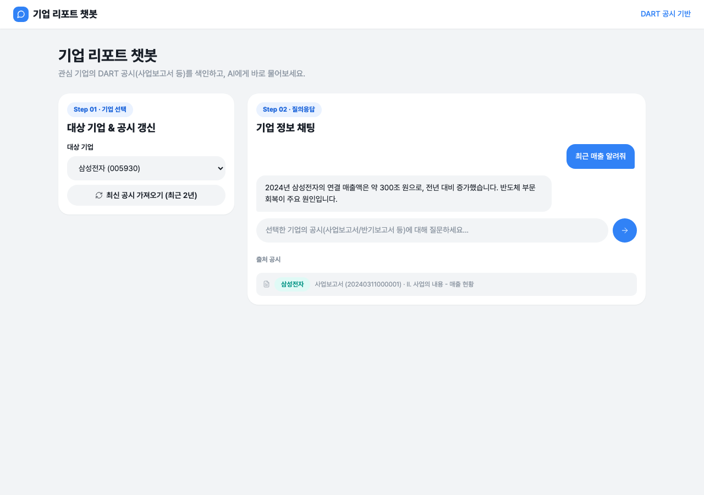
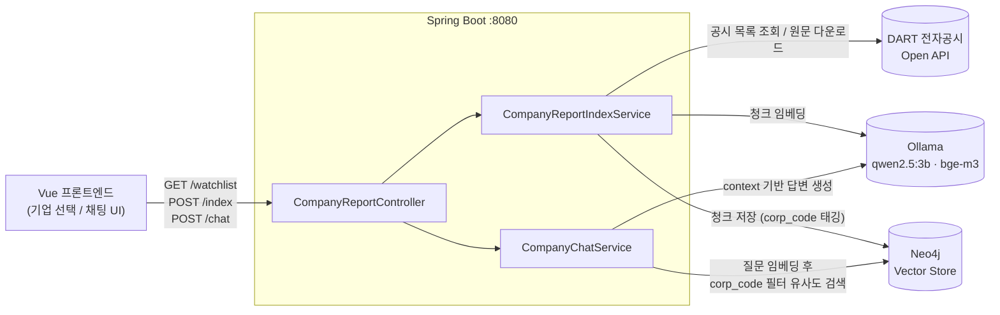

# 기업 리포트 챗봇 (Spring Boot + Spring AI + Neo4j)

DART 전자공시(사업보고서/반기보고서/분기보고서) 원문을 근거로 관심 기업에 대해
질의응답하는 RAG 챗봇입니다. 워치리스트에 등록된 기업의 정기공시를 DART Open API에서
받아와 벡터스토어(Neo4j)에 색인하고, 채팅 시 해당 기업의 공시 내용만 근거로 답변합니다.

## 사용 화면



기업을 선택하고 최신 공시를 색인한 뒤, 선택한 기업의 공시 내용에 대해 자유롭게
질문하면 답변과 함께 근거가 된 공시(회사명/보고서명/접수번호/섹션)를 보여줍니다.

## 아키텍처



색인 흐름: DART에서 공시 원문(XML)을 받아 목차 단위로 분해 → 기업/공시 메타데이터를
태깅 → 토큰 단위로 청킹 → Neo4j에 저장. 같은 공시 파일은 해시로 비교해 변경이 없으면
재색인하지 않습니다(DART API 일일 호출 제한 대응).

채팅 흐름: 질문을 임베딩해 `corp_code`로 필터링한 유사도 검색 → 검색된 공시 발췌문을
context로 넣어 LLM이 답변 생성 → 답변과 함께 근거 공시 목록을 반환.

## 기술 스택

- **Backend**: Spring Boot 3.4, Spring AI 1.0 (Ollama 모델 + Neo4j 벡터스토어)
- **LLM/임베딩**: Ollama (`qwen2.5:3b` 채팅, `bge-m3` 임베딩)
- **벡터스토어**: Neo4j
- **외부 API**: DART(전자공시시스템) Open API
- **Frontend**: Vue 3 + TypeScript + Vite

## 실행 방법

### 1) 사전 준비

**Ollama** (로컬에서 실행 중이어야 함):

```bash
ollama serve
ollama pull qwen2.5:3b
ollama pull bge-m3
```

**Neo4j** (Docker 예시):

```bash
docker run -d --name neo4j \
  -p 7474:7474 -p 7687:7687 \
  -e NEO4J_AUTH=neo4j/companyreport \
  neo4j:5
```

기본 접속 정보는 `application.yml`에 설정되어 있으며, 필요 시 환경변수로 덮어쓸 수
있습니다: `NEO4J_URI`, `NEO4J_USERNAME`, `NEO4J_PASSWORD`.

**DART API 키**: [DART Open API](https://opendart.fss.or.kr)에서 발급받아
`DART_API_KEY` 환경변수로 설정합니다.

```bash
export DART_API_KEY=발급받은키
```

### 2) 실행

```bash
./gradlew bootRun
```

프론트엔드 빌드(`npm install` + `npm run build`)까지 자동으로 수행한 뒤
`http://localhost:8080`에서 앱 전체(백엔드+프론트)가 뜹니다.

프론트엔드만 빠르게 붙여서 UI를 확인하려면(핫리로드):

```bash
cd frontend
npm install
npm run dev   # http://localhost:5173, /api는 8080으로 프록시
```

### 3) 사용 순서

1. 기업 선택 후 "최신 공시 가져오기"로 최근 2년치 정기공시 색인
2. 채팅창에 궁금한 내용 질문 (예: "최근 매출 알려줘")
3. 답변 하단의 "출처 공시"에서 근거가 된 보고서 확인

## API 엔드포인트

| Method | Path | 설명 |
|---|---|---|
| GET | `/api/company-report/watchlist` | 워치리스트 기업 목록 조회 |
| POST | `/api/company-report/index?bgn_de=&end_de=` | 워치리스트 기업의 정기공시 색인 (기간 미지정 시 최근 2년) |
| POST | `/api/company-report/chat` | `{ question, corpCode }` → 답변 + 근거 공시 목록 |

## 패키지 구조

```
src/main/java/com/ismsp/chatbot/
├── ChatbotApplication.java          # 엔트리포인트
├── controller/
│   └── CompanyReportController.java # REST API (watchlist / index / chat)
├── service/
│   ├── CompanyReportIndexService.java # DART 공시 수집 → 청킹 → Neo4j 색인 (해시 기반 중복 방지)
│   └── CompanyChatService.java        # corp_code 필터 유사도 검색 + RAG 답변 생성
├── dart/
│   ├── DartApiClient.java            # DART Open API 클라이언트 (공시검색/원본파일 다운로드)
│   ├── DartXmlDocumentReader.java    # 공시 XML → 목차 단위 Document 변환
│   ├── DartApiException.java
│   └── dto/                          # CorpCode, DartListResponse, DisclosureItem, WatchedCompany
└── dto/                              # ChatRequest, ChatResponse, IndexResult, SourceItem

src/main/resources/
├── application.yml                   # Ollama / Neo4j / DART 설정
└── static/                           # 빌드된 프론트엔드 산출물 (npm run build 결과, 자동 생성)

frontend/
├── index.html
└── src/
    ├── main.ts
    ├── App.vue                       # 상단 nav + 2단 그리드 레이아웃
    ├── style.css                     # 디자인 토큰 + 컴포넌트 스타일
    ├── api.ts                        # 백엔드 REST 호출
    └── components/
        ├── CompanySelector.vue       # 기업 선택 + 공시 갱신
        └── ChatPanel.vue             # 채팅 UI + 출처 표시
```

## 참고

- 워치리스트는 `WatchedCompany.ALL`에 하드코딩되어 있습니다 (현재: 삼성전자, F&F).
  다른 기업을 추가하려면 DART 고유번호(`corp_code`)를 찾아 목록에 추가하면 됩니다.
- DART `document.xml` 원본만 다루며, `pdf.do`(브라우저 세션 기반 비공개 엔드포인트)는
  API로 안정적으로 받을 수 없어 지원하지 않습니다.
