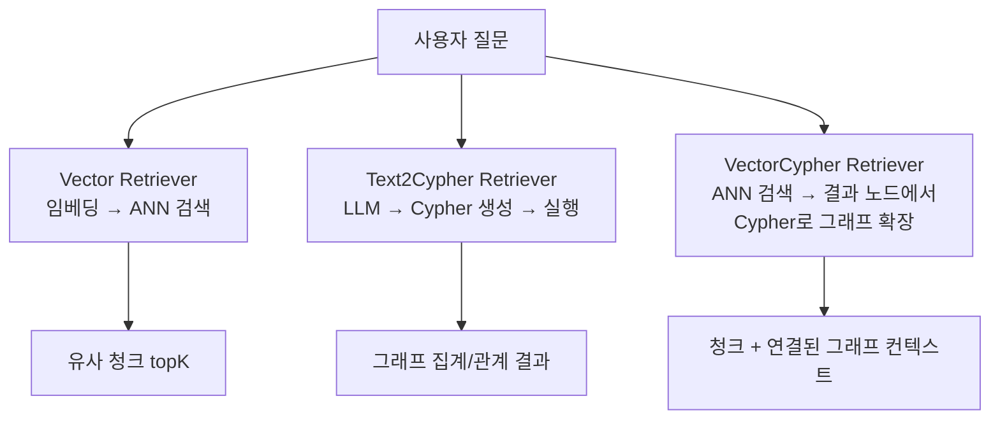
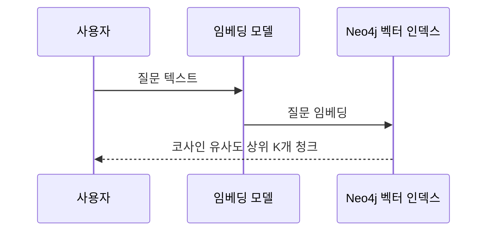
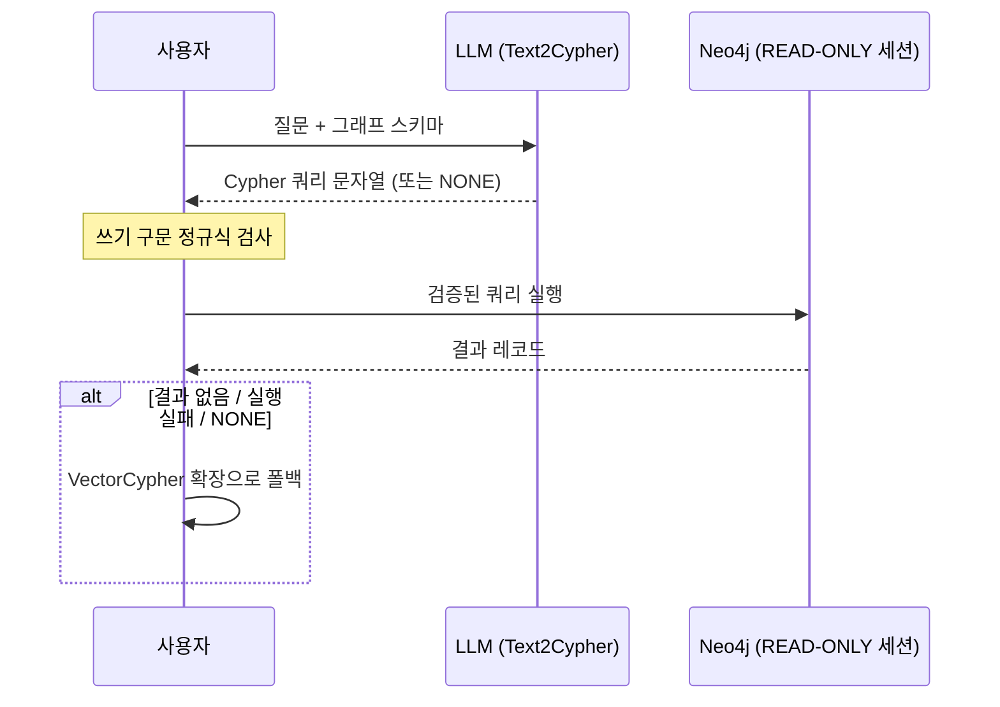
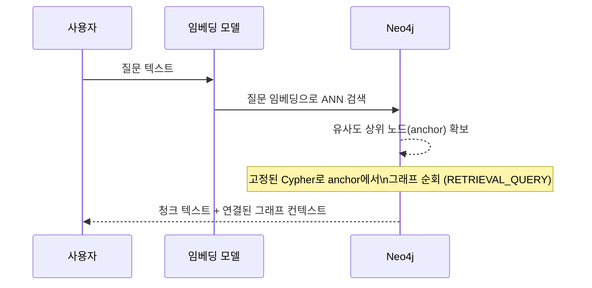

# GraphRAG 검색기(Retriever) 가이드

Neo4j 기반 GraphRAG에서 흔히 쓰이는 세 가지 검색기 — **Vector Retriever**,
**Text2Cypher Retriever**, **VectorCypher Retriever** — 의 개념과 예시를
정리합니다. 세 가지 모두 이 프로젝트(`CompanyChatService`,
`DisclosureGraphService`)에 구현되어 있습니다.

## 한눈에 비교

| | Vector Retriever | Text2Cypher Retriever | VectorCypher Retriever |
|---|---|---|---|
| 검색 방식 | 임베딩 유사도(ANN) | LLM이 생성한 Cypher 실행 | 벡터 검색 + Cypher 그래프 순회 결합 |
| 잘 답하는 질문 | "이 조항 내용이 뭐야?" 같은 의미 기반 질문 | "가장 많이 공시한 제출인 top 5는?" 같은 집계·랭킹·다중 홉 | "이 청크와 관련된 제출인·기사까지 한 번에" 같은 맥락 확장 |
| 실패 모드 | 그래프 관계(집계/교집합)는 표현 불가 | LLM이 잘못된/위험한 쿼리를 생성할 수 있음 | 두 방식의 실패 모드를 모두 안고 감 |
| 이 프로젝트 구현 | ✅ `CompanyChatService.chat()` | ✅ `CompanyChatService.buildGraphText()` (1차 시도) | ✅ `CompanyChatService.vectorCypherGraphText()` (Text2Cypher 폴백) |



---

## 1. Vector Retriever

### 개념

질문을 임베딩 벡터로 바꾼 뒤, 벡터 인덱스에서 코사인 유사도(ANN, Approximate
Nearest Neighbor)가 가장 가까운 청크 K개를 가져오는 가장 기본적인 검색기입니다.
"의미가 비슷한 텍스트를 찾는다"는 것 이상의 구조적 추론(집계, 다중 홉, 정확한
매칭)은 할 수 없습니다.

- **장점**: 구현이 단순하고, 키워드가 정확히 일치하지 않아도 의미로 찾을 수
  있음.
- **한계**: "가장 많은", "~와 ~를 동시에 공시한" 같은 집계·교집합·다중 홉 질문에는
  약함. 벡터 인덱스에 없는 정형 데이터(날짜 범위, 정확한 수치 비교 등)도 잘
  못 다룸.

### 동작 흐름



### 이 프로젝트의 예시

`CompanyChatService.chat()`에서 Spring AI의 `Neo4jVectorStore`로 기업 전용
인덱스에 대해 유사도 검색을 수행합니다.

```java
// src/main/java/com/ismsp/chatbot/service/CompanyChatService.java
SearchRequest.Builder searchRequestBuilder =
        SearchRequest.builder().query(searchQuery).topK(annTopK);
if (newsOnly) {
    // Neo4jVectorStore의 filterExpression은 ANN 검색 이후 후보군에 적용되는
    // post-filter라, 후보군을 넉넉히 가져온 뒤 잘라 쓴다.
    searchRequestBuilder.filterExpression("doc_type == 'NEWS'");
}
List<Document> context = vectorStoreRegistry.forCompany(corpCode)
        .similaritySearch(searchRequestBuilder.build());
```

내부적으로 Neo4j에서는 다음과 같은 벡터 인덱스 쿼리가 실행됩니다.

```cypher
CALL db.index.vector.queryNodes('company_report_chunk_index', $topK, $queryEmbedding)
YIELD node, score
RETURN node.text AS text, node.corp_name AS corpName, score
ORDER BY score DESC
```

---

## 2. Text2Cypher Retriever

### 개념

LLM에게 그래프 스키마를 프롬프트로 알려주고, 자연어 질문을 **읽기 전용
Cypher 쿼리**로 직접 생성하게 한 뒤 그 쿼리를 실행해서 결과를 컨텍스트로
사용하는 방식입니다. 벡터 검색이 못 하는 집계·랭킹·다중 홉·교집합 질문
("이 사람이 지분을 공시한 다른 회사는?", "가장 많이 공시한 제출인은?")에
강합니다.

- **장점**: 그래프 구조를 그대로 활용하는 임의의 질의가 가능(고정 쿼리를
  미리 다 만들어둘 필요가 없음).
- **한계**: LLM이 스키마에 없는 라벨/속성을 지어내거나 문법이 틀린 쿼리를
  생성할 수 있음. 잘못하면 쓰기 쿼리(`CREATE`/`DELETE` 등)를 생성해 그래프를
  훼손할 위험이 있으므로 **반드시 검증 + 읽기 전용 실행 + 폴백**이 필요합니다.

### 동작 흐름



### 이 프로젝트의 예시

`CompanyChatService`가 스키마를 프롬프트에 포함해 LLM에게 Cypher 생성을
맡기고, `DisclosureGraphService.runReadOnlyQuery()`가 이중 안전장치로 실행합니다.

```java
// src/main/java/com/ismsp/chatbot/service/CompanyChatService.java
private static final Pattern WRITE_CLAUSE = Pattern.compile(
        "(?i)\\b(CREATE|MERGE|DELETE|SET|REMOVE|DROP|LOAD\\s+CSV|CALL\\s+apoc)\\b");

private String generateGraphQuery(String corpCode, String question, String llm) {
    String raw = complete(llm, "", CYPHER_ROUTER_PROMPT_TEMPLATE.formatted(corpCode, question));
    String cypher = raw.replaceAll("(?s)```(?:cypher)?", "").trim();
    if (cypher.isBlank() || "NONE".equalsIgnoreCase(cypher) || WRITE_CLAUSE.matcher(cypher).find()) {
        return null; // 쓰기 구문 포함 시 애초에 실행하지 않음 (1차 방어)
    }
    return cypher;
}
```

```java
// src/main/java/com/ismsp/chatbot/service/DisclosureGraphService.java
public String runReadOnlyQuery(String cypher) {
    // 세션 자체를 READ 접근 모드로 열어, 정규식 검사를 통과한 쓰기 쿼리라도
    // Neo4j 서버 단에서 다시 한번 거부되도록 이중으로 막는다 (2차 방어).
    SessionConfig readOnly = SessionConfig.builder().withDefaultAccessMode(AccessMode.READ).build();
    try (Session session = driver.session(readOnly)) {
        List<Record> records = session.run(cypher).list();
        ...
    }
}
```

LLM이 실제로 생성할 법한 쿼리 예시 (스키마: `(:Filer)-[:DISCLOSED]->(:Report)-[:FILED_BY]->(:Company)`):

```cypher
// 질문: "이 회사에 지분을 가장 많이 공시한 제출인 top 3는?"
MATCH (f:Filer)-[:DISCLOSED]->(r:Report)-[:FILED_BY]->(co:Company {corp_code: '00126380'})
RETURN f.name AS filerName, count(r) AS disclosureCount
ORDER BY disclosureCount DESC
LIMIT 3
```

생성 실패, `NONE` 응답, 결과 없음, 실행 예외 발생 시 모두 아래 3절의
VectorCypher Retriever(`vectorCypherGraphText()`)로 폴백해 안전성을 확보합니다.

---

## 3. VectorCypher Retriever

### 개념

Vector Retriever와 Text2Cypher Retriever를 **한 번의 검색 안에서 결합**한
방식입니다. 먼저 벡터 유사도로 "출발점이 되는 노드(anchor node)"를 찾고,
그 노드에서부터 고정된(또는 파라미터화된) Cypher 순회 쿼리로 그래프의 이웃
정보를 함께 끌어옵니다. neo4j-graphrag-python 라이브러리의
`VectorCypherRetriever`가 이 패턴의 대표적인 구현체입니다.

Text2Cypher와 다른 점은 **Cypher 쿼리 자체는 LLM이 즉석에서 짓지 않고
개발자가 미리 정의**해 둔다는 것입니다. LLM이 매번 임의의 쿼리를 생성하는
대신, "벡터로 찾은 노드 → 이 관계를 따라가서 이런 필드를 가져온다"는 순회
로직만 고정하고, 벡터 검색이 어떤 노드를 앵커로 줄지만 매번 달라집니다.
그래서 Text2Cypher보다 예측 가능하고 안전하면서도, 순수 Vector Retriever보다
풍부한 그래프 컨텍스트를 한 번의 호출로 얻습니다.

- **장점**: LLM이 쿼리를 짓지 않으므로 Text2Cypher보다 안전(쓰기 쿼리 생성
  위험 없음)하고 지연시간도 낮음. 벡터 검색 결과에 그래프 관계를 자동으로
  붙여주므로 별도의 "고정 조회 폴백" 로직이 필요 없음.
- **한계**: 순회 경로(`retrieval_query`)를 스키마 변경 시마다 개발자가 직접
  갱신해야 함. Text2Cypher처럼 임의의 새로운 질문 유형(사전에 설계하지 않은
  관계 패턴)에는 대응하지 못함.

### 동작 흐름



### 일반적인 예시 (다른 라이브러리 스타일: neo4j-graphrag-python)

```python
from neo4j_graphrag.retrievers import VectorCypherRetriever

retrieval_query = """
// $node 는 벡터 검색으로 찾은 anchor 청크 노드
MATCH (node)<-[:HAS_CHUNK]-(article:Article)-[:ABOUT]->(company:Company)
OPTIONAL MATCH (media:Media)-[:PUBLISHED]->(article)
RETURN
    node.text AS chunkText,
    article.title AS articleTitle,
    company.name AS companyName,
    media.name  AS mediaName,
    score
"""

retriever = VectorCypherRetriever(
    driver=driver,
    index_name="company_report_chunk_index",
    retrieval_query=retrieval_query,
    embedder=embedder,
)

results = retriever.search(query_text="F&F 관련 최근 뉴스는?", top_k=5)
```

### 이 프로젝트의 예시

Text2Cypher가 실패/`NONE`/빈 결과일 때의 폴백이 바로 VectorCypher입니다.
`chat()`에서 이미 뽑은 topK 청크(`context`)의 메타데이터(`rcept_no`,
`article_url`)를 앵커로, LLM 없이 고정된 Cypher 한 번으로 그래프를 확장합니다.
`elementId()`로 청크 자체를 다시 찾아 순회하는 대신, 청크에 이미 박혀 있는
`rcept_no`/`article_url` 값으로 곧장 `Report`/`Article` 노드에 조인합니다
(청크→노드 관계를 새로 만들 필요가 없음).

```java
// src/main/java/com/ismsp/chatbot/service/CompanyChatService.java
private String vectorCypherGraphText(String corpCode, List<Document> context) {
    List<String> rceptNos = context.stream()
            .filter(d -> "D".equals(d.getMetadata().get("pblntf_ty")))
            .map(d -> String.valueOf(d.getMetadata().get("rcept_no")))
            .distinct()
            .toList();
    List<String> articleUrls = context.stream()
            .filter(d -> "NEWS".equals(d.getMetadata().get("doc_type")))
            .map(d -> String.valueOf(d.getMetadata().get("article_url")))
            .distinct()
            .toList();
    // ... 둘 다 비면 그래프 확장 스킵, 아니면 아래 쿼리 한 번으로 확장
    return formatGraphExpansionRows(
            disclosureGraphService.expandRetrievedContext(corpCode, rceptNos, articleUrls, VECTOR_CYPHER_LIMIT));
}
```

```cypher
-- src/main/java/com/ismsp/chatbot/service/DisclosureGraphService.java: expandRetrievedContext()
-- $rceptNos/$articleUrls 는 검색된 청크들의 metadata에서 뽑은 앵커 리스트
CALL {
    UNWIND $rceptNos AS rceptNo
    MATCH (f:Filer)-[:DISCLOSED]->(r:Report {rcept_no: rceptNo})-[:FILED_BY]->(:Company {corp_code: $corpCode})
    OPTIONAL MATCH (f)-[:DISCLOSED]->(:Report)-[:FILED_BY]->(other:Company)
    WHERE other.corp_code <> $corpCode
    RETURN 'DISCLOSURE' AS kind, rceptNo AS anchor, f.name AS primaryName,
           r.report_nm AS secondaryName, other.corp_code AS relatedCorpCode, other.name AS relatedCorpName

    UNION ALL

    UNWIND $articleUrls AS articleUrl
    MATCH (a:Article {url: articleUrl})-[:ABOUT]->(other:Company)
    WHERE other.corp_code <> $corpCode
    OPTIONAL MATCH (m:Media)-[:PUBLISHED]->(a)
    RETURN 'NEWS' AS kind, articleUrl AS anchor, coalesce(m.name, '(언론사 미상)') AS primaryName,
           a.title AS secondaryName, other.corp_code AS relatedCorpCode, other.name AS relatedCorpName
}
RETURN DISTINCT kind, anchor, primaryName, secondaryName, relatedCorpCode, relatedCorpName
LIMIT $limit
```

`UNWIND` + `CALL {} ... UNION ALL`로 지분공시 앵커와 뉴스 앵커를 한 번의
Neo4j 왕복에서 함께 처리합니다(N+1 방지). 두 리스트가 다 비어 있으면
(`UNWIND`가 빈 리스트를 받으면 그 브랜치는 자연히 0행) 별도 분기 없이
그래프 확장을 건너뜁니다. 이 쿼리는 사용자 질문이 아니라 이미 검증된
메타데이터 값만 파라미터로 바인딩하므로, Text2Cypher처럼 `WRITE_CLAUSE`
검사나 `AccessMode.READ` 세션이 필요 없습니다 — `findFilers`와 같은 신뢰
수준의 고정 조회입니다.

이렇게 해서 `DisclosureGraphService.findFilers()`(기업 전체 최근 제출인
10명, 검색 결과와 무관)로 폴백하던 것을, "이번 검색으로 실제 근거가 된
공시/기사와 연결된" 그래프 정보로 대체했습니다. Text2Cypher는 여전히
사전에 설계하지 못한 집계·랭킹 질문에 먼저 쓰이고, 흔한 패턴(청크 →
공시/기사 → 제출인·관련 기업·언론사)은 VectorCypher가 더 빠르고 안전하게
처리합니다.

---

## 참고

- 이 프로젝트의 그래프 스키마: `README.md`의 "그래프 DB 스키마" 절
- 이 프로젝트의 검색 전략 설명: `README.md`의 "검색 전략: Vector Retriever +
  Text2Cypher" 절
- 아이디어 출처: [graphrag-tools-retriever](https://github.com/gongwon-nayeon/graphrag-tools-retriever)
- Neo4j 공식 GraphRAG 라이브러리(Python) 리트리버 문서: `neo4j-graphrag-python`의
  `VectorRetriever`, `VectorCypherRetriever`, `Text2CypherRetriever`
